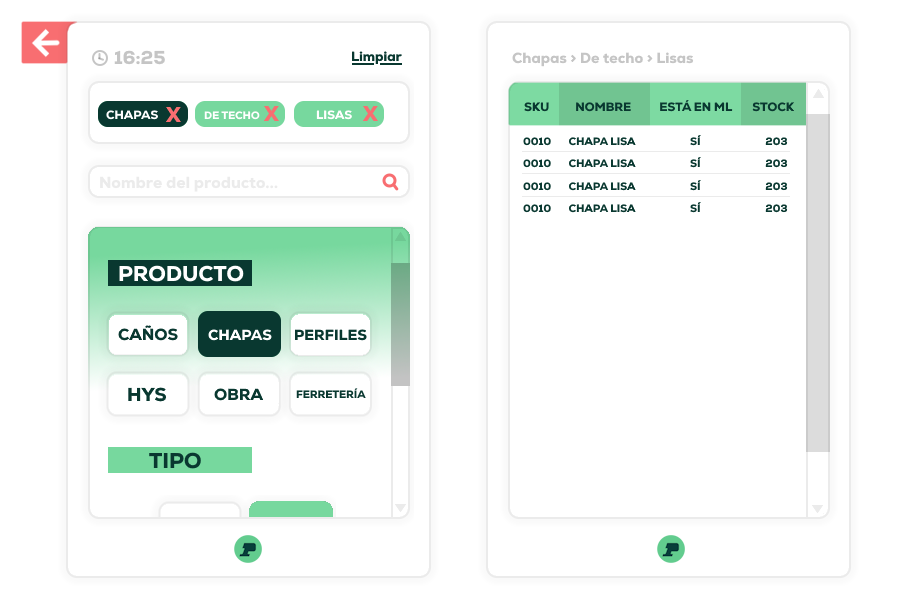
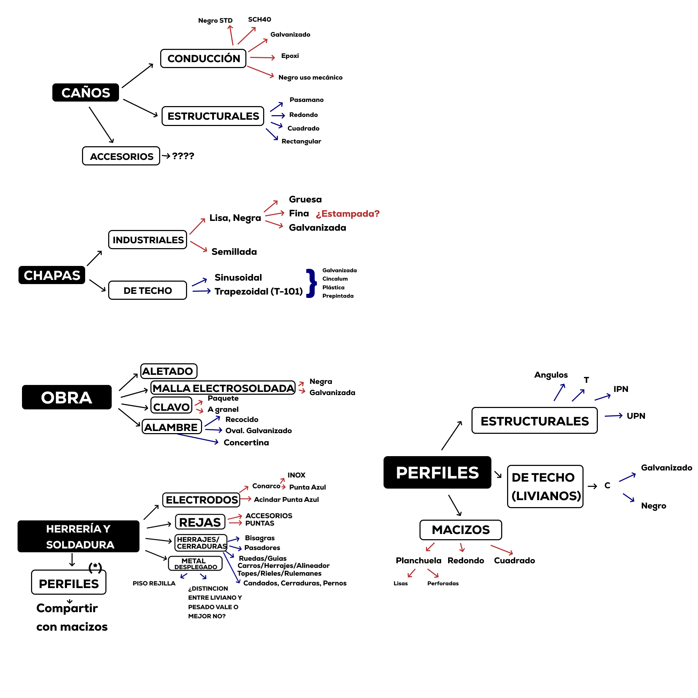
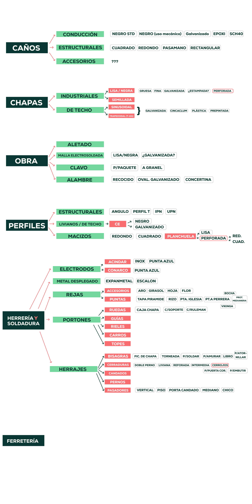

# Perticari Product Manager 🏗️

Internal product navigation system designed for a steel and construction materials distributor.

> 🇦🇷 Proyecto desarrollado para mejorar la búsqueda de productos con múltiples variantes dentro de un entorno real de trabajo.

---

## 🚀 Overview

This application solves a common problem in industrial catalogs:

> Products with many attributes (size, material, type) become hard to browse using traditional filters.

Instead of static filters, this system provides a **dynamic, hierarchical navigation UI** that adapts based on user selections.

---

## 🧠 Core Idea

The system is built around a recursive **node-based structure**:

- Each step in the UI is a `Node`
- Each node defines:
  - Available options
  - The next node in the flow

The interface is generated dynamically at runtime, allowing flexible and scalable navigation.

---

## ⚙️ How it works

- UI is rendered dynamically using WinForms panels
- Each selection updates a filter state (`Dictionary<string, string>`)
- Navigation is rebuilt on each interaction
- Product filtering is handled via LINQ over flexible attribute dictionaries

This allows mixing completely different product types without breaking the logic.

---
## 🖼️ UI Evolution & Product Structure

This project went through multiple iterations focused on improving usability and navigation clarity.

### 🎨 Early UI Concept
Initial approach to the interface. Functional, but visually basic and less intuitive.

---

### ✨ Final UI
Refined design with improved hierarchy, spacing, and visual feedback.

---

### 🌳 Product Tree (Initial)
Early representation of how product categories and attributes were structured.

---

### 🌿 Product Tree (Current)

## 🎮 Features

- 🔢 Keyboard navigation (1–9 selection)
- 🔙 Back navigation (Q / ESC)
- 🧩 Dynamic UI generation (no hardcoded layouts)
- 🏷️ Visual filter chips + breadcrumb
- 🔍 Live search
- 📊 Real-time filtered DataGrid

---

## 🖼️ Screenshots

### Main Interface
*(add screenshot here)*

### Product Navigation
*(add screenshot here)*

### Data Grid
*(add screenshot here)*

---

## 🧱 Architecture Highlights

- Recursive node system for navigation
- Decoupled UI rendering (`RenderSeccion`, `ConstruirCascada`)
- Flexible filtering model using dictionaries
- Runtime-generated controls

---

## 📌 Roadmap

- [ ] Refactor domain classes (`Producto`, `Nodo`)
- [ ] Load data from external database
- [ ] Improve navigation model (history stack)
- [ ] UI transitions / animations
- [ ] Export / quoting module

---

Developed by **Joaquín Altamirano**

